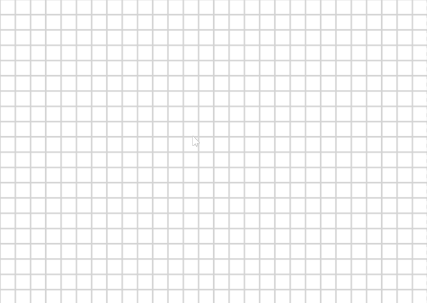
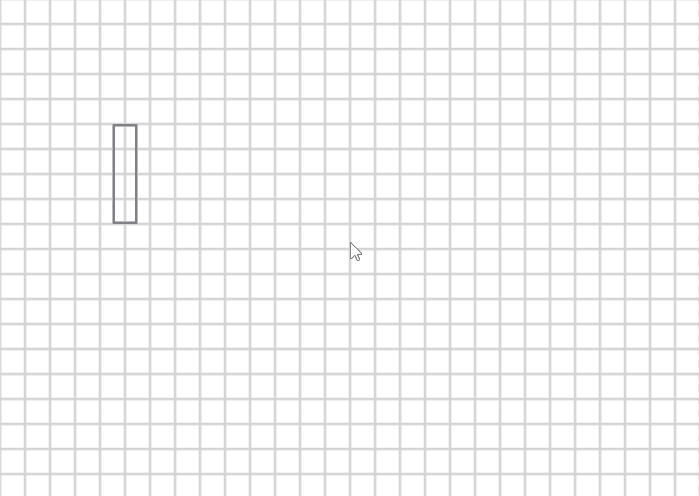
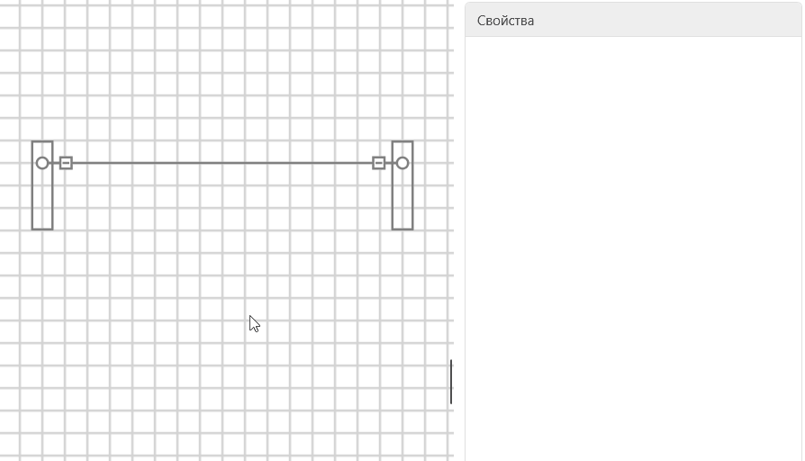
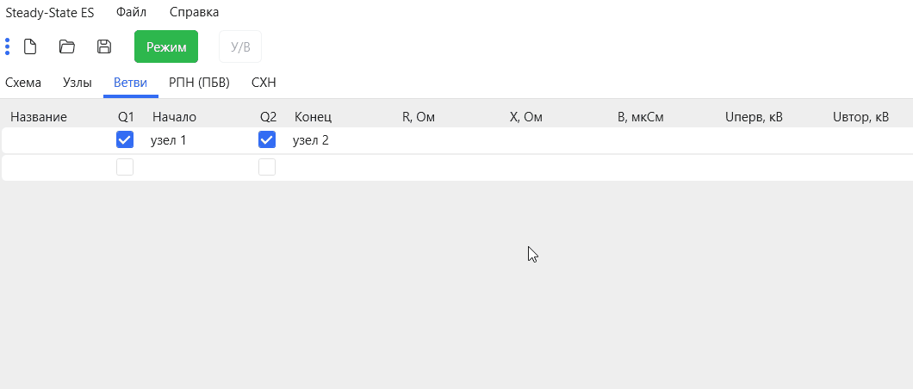
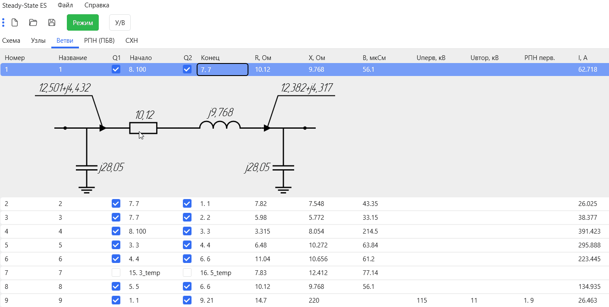
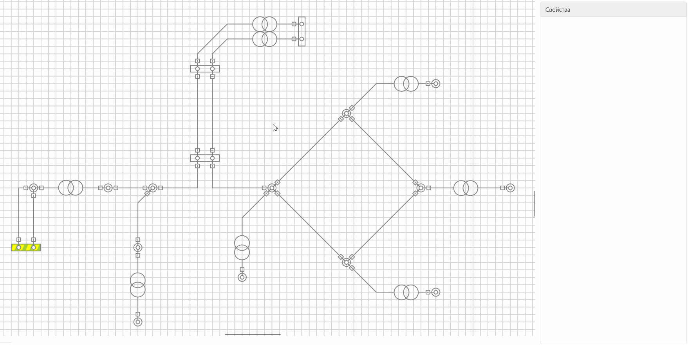
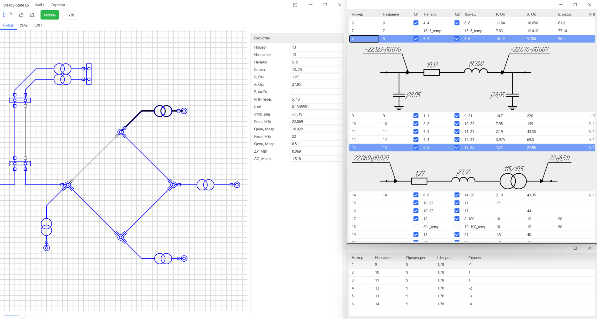

# Steady-State ES
### Программа для расчета установившихся режимов электроэнергетических систем.

При проектировании электроэнергетических систем требуется учитывать их основные свойства: многообразие свойств и состояний, большое число элементов, которые различаются функционально, но работают в едином режиме, сложность и разнообразие структуры и режимов работы, многовариантность развития. При этом проектировщикам приходится выполнять большой объем расчетов установившихся режимов – так проверяется допустимость принятых решений по условиям загрузки элементов электрических сетей, а также по возможностям регулирования потокораспределения и уровней напряжения.

Понятно, что при выполнении всех этих операций необходимы программы для расчетов установившихся режимов, которые обладают высокой точностью, быстродействием, надежностью получаемых результатов, возможностью их визуализации.

В основу расчета установившегося режима положено решение системы нелинейных уравнений большой размерности, что само по себе сопряжено с большими сложностями. Решение таких систем уравнений осуществляется численными итерационными методами (в данном случае метод [Ньютона-Рафсона](https://ru.wikipedia.org/wiki/%D0%9C%D0%B5%D1%82%D0%BE%D0%B4_%D0%9D%D1%8C%D1%8E%D1%82%D0%BE%D0%BD%D0%B0)), а это зачастую сопровождается возникновением проблем сходимости и однозначности решения. В свою очередь, практически все проблемы сходимости так или иначе связаны с корректностью задания исходных данных. При больших объемах данных, которые необходимо ввести для расчета, велик риск ошибки, следствием которой становится расходящийся итерационный процесс. Другой причиной может оказаться несоответствие заданных нагрузок пропускным способностям элементов электрической сети, что в случае больших электроэнергетических систем далеко не очевидно. 

Для вышеизложенных задач была разработана программа, которая предназначена для расчета установившихся режимов сложных трехфазных симметричных электроэнергетических систем произвольной конфигурации. Программа требует составления и расчета схемы замещения, представленной в виде ветвей и узлов, без необходимости приведения параметров к одному напряжению.

### Заполнение конфигурации схемы замещения
Ввод данных осуществляется двумя способами:
- С использованием графического редактора схемы замещения;
- С помощью таблиц, соответствующих узлам и ветвям схемы (такие элементы не отображаются на схеме замещения).

#### Графический редактор схемы замещения
Добавление элементов схемы замещения осуществляется со помощью вызова контекстного меню правой кнопкой мыши. 
 - Добавление узлов

    

 - Добавление ветвей

   

#### Параметры элементов схемы замещения

Указать параметры элементов схемы замещения можно двумя способами:
- Выделить нужный элемент схемы и заполнить поля на панели свойств

   

- Заполнить параметры в соответствующих таблицах

   

  > При выборе ветви отображается подробная информация об этой ветви в виде схемы замещения, с нанесенными на нее параметрами. Каждый параметр соответствует своему значению из колонки.

#### Возможности программы

Помимо основных функций, а именно нахождения напряжений в узлах схемы замещения и расчета потокораспределения, программа имеет большой спектр дополнительных возможностей, которые позволяют моделировать самые сложные схемы:
- Учет опорных узлов тип P, U = const
- Учет статических характеристик нагрузки
- Учет устройств регулирования (РПН, ПБВ)
- Моделирование фазоповоротного устройства
- Гибкая настройка программы

   

  > Параметры позволяют производить настройку программы с помощью дополнительной формы. Основная возможность параметров – это возможность для каждой расчетной величины изменять точность ее отображения и размерность, а также включение расчета в относительных единицах. Настроенные параметры отображения можно сохранить, чтобы применять их в других проектах.

- Автоматическое отслеживание связи между объектами и соответствующими узлами и ветвями расчетной схемы

   

  > Позволяет значительно упростить процесс подготовки исходной информации для расчета режимов сложной электрической сети и исключить ошибки при определении параметров схем замещения

## Общий вид программы

